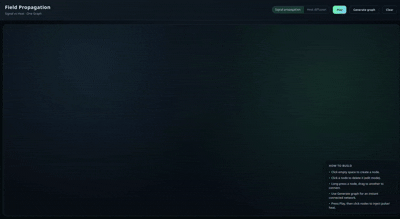

# Field Propagation

Signal propagation and heat diffusion on the same graph — build nodes, connect synapses, and watch interference patterns and thermal flow evolve.



## What it is
Two visual simulations on a shared graph:
- **Signal propagation**: nodes hold scalar signal values and edges attenuate, delay, or amplify pulses.
- **Heat diffusion**: heat spreads across edges, cycles trap heat, and sparse trees cool quickly.

Switch modes at any time without losing your graph.

## How to use
- Click empty space to create a node.
- Click a node to delete it (edit mode).
- Long-press a node, drag to another node to connect.
- Use **Generate graph** for an instant connected network.
- Press **Play** and click nodes to inject pulse/heat.

## Run locally
Open `index.html` in your browser.

If you prefer a dev server:
```bash
npx serve .
```

## Project layout
- `index.html` — UI shell and controls
- `style.css` — visual theme
- `app.js` — graph editor + simulation logic

## License
MIT © 2026 Andrew Muratov
